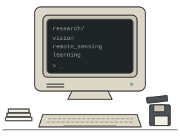

# Dineth Perera

**Undergraduate Researcher** · Electrical and Electronic Engineering · University of Peradeniya, Sri Lanka

`computer vision` · `remote sensing` · `Earth observation` · `machine learning`

I am an undergraduate researcher in Electrical and Electronic Engineering at the University of Peradeniya, Sri Lanka. My research focuses on computer vision, remote sensing, Earth observation and machine learning, particularly remote-sensing change detection, visual state-space models and representation learning.

I am interested in developing learning methods that improve how machine-learning systems represent and reason about multi-temporal Earth-observation imagery.

> **Research opportunities:** I am seeking research internship and visiting research opportunities from **April to September 2027** in computer vision, remote sensing, Earth observation, and machine learning.

[CV](https://dineth14.github.io/Research_portfolio/Documents/CV.pdf)
· [Google Scholar](https://scholar.google.com/citations?hl=en&user=MxZgkDYAAAAJ)
· [Hugging Face](https://huggingface.co/dineth14)
· [LinkedIn](https://www.linkedin.com/in/dineth-perera-ba9657277/)
· [Email](mailto:dp18perera@gmail.com)
· [Website](https://dineth14.github.io/Research_portfolio/)

---

## Research

### ORBIT-Mamba
*Manuscript in final preparation · Target: IEEE Transactions on Geoscience and Remote Sensing (TGRS)*

ORBIT-Mamba: Operator-Conditioned Region–Boundary Temporal Specialization for Remote Sensing Change Detection. The work investigates whether semantic Region recognition and structural Boundary localization should be constrained to the same bi-temporal representation. The framework independently conditions temporal evidence for Region and Boundary learning, and uses Differential Region–Boundary Modulation, auxiliary structural supervision, and a Weighted Adaptive Receptive Field Feature Pyramid Network.

`VMamba-S` · `operator-conditioned temporal evidence` · `D-RBM` · `WARF-FPN`

[Project](https://github.com/Dineth14/ORBIT-Mamba) · [Code](https://github.com/Dineth14/ORBIT-Mamba)

---

### MambaRefine-CD
*MERCon 2026 · Accepted · Presented · Published in IEEE Xplore*

MambaRefine-CD: MambaVision with Region–Boundary Temporal Refinement. A MambaVision-based binary remote-sensing change-detection framework that constructs temporal evidence from paired, absolute-difference and signed-difference features, and explicitly separates region and boundary representations through Differential Region–Boundary Interaction. Region features are decoded through adaptive receptive-field processing, while boundary information provides controlled refinement.

[IEEE Xplore](https://ieeexplore.ieee.org/document/11691356/metrics#metrics) · [Paper](https://arxiv.org/pdf/2607.04403) · [Code](https://github.com/Dineth14/MambaRefine-CD)

---

### Visual State-Space Models for Remote-Sensing Segmentation
*IGARSS 2026 · Accepted and presented*

A Controlled Benchmark of Visual State-Space Backbones with Domain-Shift and Boundary Analysis for Remote-Sensing Segmentation. A strictly controlled evaluation of VMamba, MambaVision and Spatial-Mamba backbones for remote-sensing semantic segmentation, using a common four-stage feature interface, fixed decoder and identical training protocol. The work studies accuracy–efficiency trade-offs, domain shift and boundary failure modes on LoveDA and ISPRS Potsdam.

[Paper (arXiv:2604.18721)](https://arxiv.org/abs/2604.18721) · [Code](https://github.com/Dineth14/Mamba-Segmentation)

---

### Multi-Hazard Remote Sensing Dataset
*Dataset development · Ongoing*

Development of a multi-hazard Earth-observation dataset for disaster change analysis, covering wildfire, tsunami, flood and landslide events. The project focuses on organizing multi-temporal imagery and annotations for future change-detection and geospatial machine-learning benchmarks.

---

## Currently

- Preparing the final ORBIT-Mamba manuscript for TGRS.
- Developing a multi-hazard remote-sensing dataset.
- Exploring representation learning for bi-temporal Earth-observation imagery.
- Preparing for 2027 research internship applications.

## Tools I Use

`Python` · `PyTorch` · `OpenCV` · `MATLAB` · `C/C++` · `Linux` · `Git` · `LaTeX`

`Computer Vision` · `Remote Sensing` · `Signal Processing` · `Deep Learning`

---

